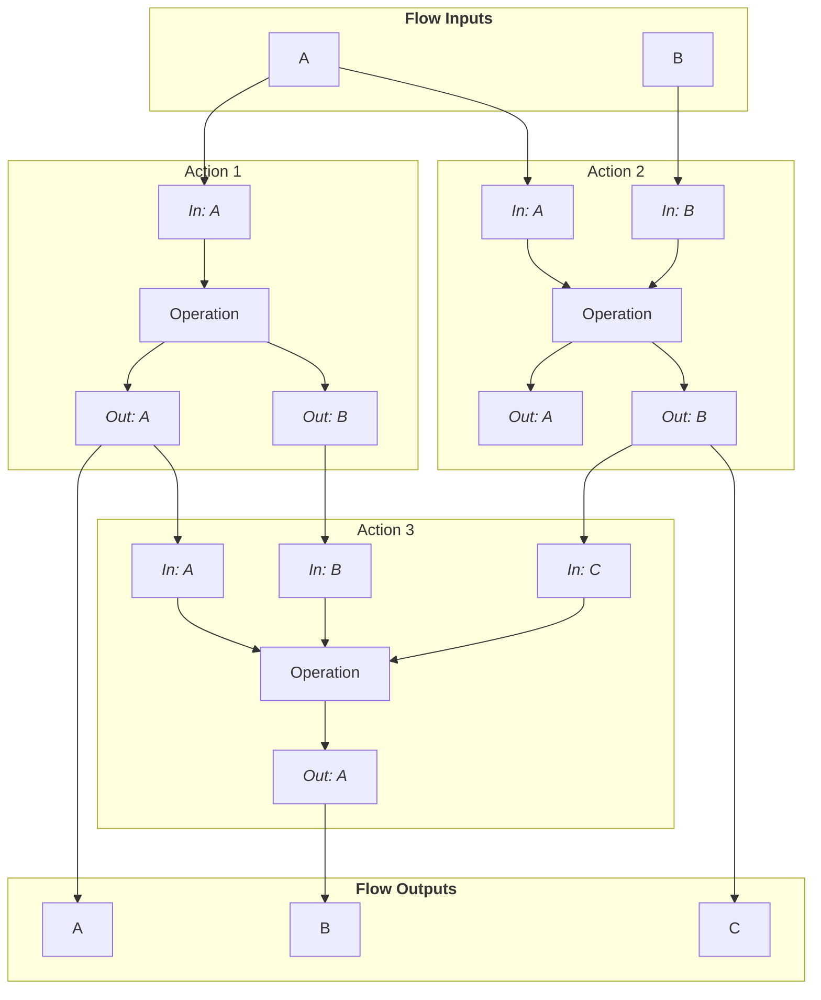

# Action I/O

Action IO is the way of transmitting data between actions.
In most cases, you will also use some data to start with and ingest it into the flow at the beginning.
In the end, you will extract some generated artifact data from the flow.
This is possible by defining inputs and outputs on the flow and its actions.
Actions will not be scheduled until all of its inputs are available.



## Definition of inputs and outputs

- Each input **requests** data from an entity.
- Each output **provides** data from an entity.

For actions, this is simple:

- An input requests data from somewhere and provides it to the operation.
- An output provides data from the operation to others.

Regarding flow inputs/outputs, you need to think about the naming in reverse.

- A flow input provides data from the host machine to others - like an output.
- A flow output requests data from somewhere and provides it to the host machine - like an input.

How does this look in practice?
Here is an input definition.

```yaml
# Source of the data.
source: action.maxTemperature.out.max
# How data is provided to the action/host.
provideAs: stdin
```

Each input requires a **source**.
Syntax:

- `flow.in.<input_name>`: Request a flow input.
- `action.<action_name>.out.<output_name>`: Request an action's output.

It then provides the data to the operation/host with a specific method.
Methods may also depend on the operation.
For example, the action input type [workspace file](./action-inputs/workspace-file.mdx) cannot be used with the [command action type](./actions/command-action.mdx).

Outputs are declared like this:

```yaml
# How data is available in the action/host.
providedAs: stdout
```

For a list of available input/output types, see the sections about flow/action inputs/outputs.

## Data transmission

LWEE manages data transmission in Action IO.
Data is transmitted in raw form and not encoded in any way.
Because of async IO, (de)multiplexing and some applications calling write many times, LWEE does not directly copy incoming data.
Instead, it buffers it and then sends it to the receivers.
Buffer swapping is applied here as well so that the writing application can continue to write data while LWEE forwards the previous batch to receivers.

## Optimizations

LWEE has support for providing optimizations for certain combinations of input/output types.

Currently, an optimization is being applied if source data is provided as [workspace file](./action-inputs/workspace-file.mdx) and requested like this as well.
If there is only one request for the file, it will be moved instead of being copied.
This is especially useful for large files.
