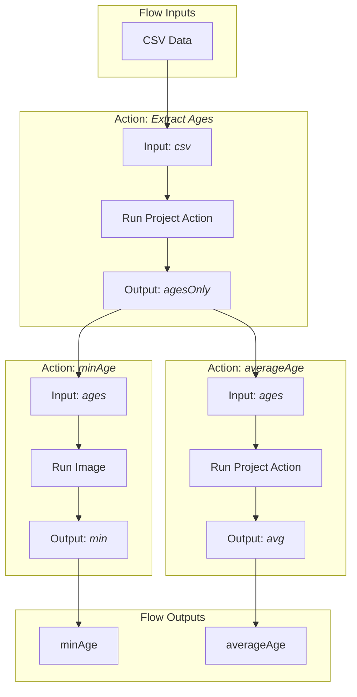

# Concepts

LWEE is - as the name suggests - a workflow execution engine.

## Flow

Center is a flow definition that describes various inputs and outputs as well as actions that perform operations on these.
Flows are described in [YAML](https://yaml.org/).
A small workflow may look like this:

```yaml
name: People analytics
description: Reads a CSV file with columns 'name' and 'age' and outputs statistics.

in:
  csvData:
    providedAs: file
    filename: src/people.txt

actions:
  extractAges:
    description: Extracts ages from CSV and outputs them, separated by line breaks.
    in:
      csv:
        source: flow.in.csvData
        provideAs: workspace-file
        filename: data.csv
    run:
      type: proj-action
      name: extract-age
    out:
      agesOnly:
        providedAs: workspace-file
        filename: ages.txt

  minAge:
    description: Takes ages, separated by line breaks, and outputs the minimum.
    in:
      ages:
        source: action.extractAges.out.agesOnly
        provideAs: stdin
    run:
      type: image
      image: my-repository:tag
    out:
      min:
        providedAs: stdout

  averageAge:
    description: Takes ages, separated by line breaks, and outputs the average.
    in:
      ages:
        source: action.extractAges.out.agesOnly
        provideAs: stream
        streamName: numbers
    run:
      type: proj-action
      name: average
    out:
      avg:
        providedAs: stream
        streamName: average

out:
  minAge:
    source: action.minAge.out.min
    provideAs: file
    filename: out/minimum-age.txt
  averageAge:
    source: action.averageAge.out.avg
    provideAs: file
    filename: out/average-age.txt
```

Visualized, the flow looks like this:



## Actions

Actions perform arbitrary operations on data.
The recommended way is using container images.
This bundles all required dependencies and allows reproducible operations.
Locally installed applications require more effort to be used.
They need to be installed and set up along with their dependencies.
One also needs to make sure that the correct version is installed in case of changes due to application updates.
Additionally, features might depend on the host operating system.

LWEE provides you with three forms of actions.

- Project actions
- External container images
- Local commands

Project actions are the recommended way to use actions.
They consist of source code within the LWEE project as well as a [Dockerfile](https://docs.docker.com/engine/reference/builder/), used to build a container image.
Read more about actions in the [Actions section](./actions/index.mdx).

## Flow and Action IO

Actions and the flow itself allow ingesting and extracting data.
Each action describes its required inputs and provided outputs.
LWEE handles the data transmission inbetween.

Once output data comes available, the transmission is opened.
Data is then transmitted to the recipient.
In practice, an action is not being started until all required inputs become available.
This results in the actions forming a directed graph.

:::note
No cycles are allowed for action IO.
:::

Read more about action IO in [this](./action-io.mdx) section.
