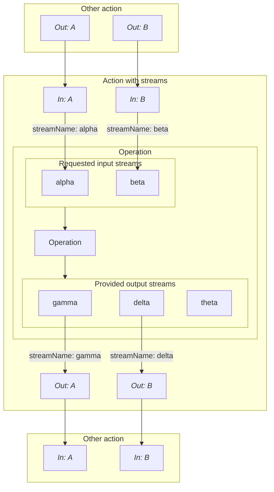

# Streams

Streams in LWEE allow data exchange over HTTP communication.
LWEE supports multiple data streams at once.
Streams are also the goto way of building SDKs.
Each one has a name and can be either an input or output.

When declaring inputs for an action with [stream type](./action-inputs/stream.mdx), you specify the stream name as the operation expects it.
Stream names in outputs with [stream type](./action-outputs/stream.mdx) need to match the stream name as the operator provides it.

In practice the mapping looks like this:



As with action IO, not all provided output streams need to be used by action outputs.
In this case _theta_ remains unused and will be drained by LWEE.

## Target HTTP endpoints

LWEE expects the client to open an HTTP API at port 17733 and to provide multiple HTTP endpoints.

HTTP buffer size is 1MB.

### Connection and verification

```http
GET http://<target>/api/v1/io
```

Upon startup, LWEE will request an IO summary from the target.
If the connection fails, LWEE will retry periodically until the connection succeeds or a timeout occurs.

The target is expected to return a **200** status code with the following JSON encoded response data:

```json
{
  "requested_input_streams": [],
  "provided_output_streams": []
}
```

- `requested_input_streams`: List of strings with the names of the requested input streams.
- `provided_output_streams`: List of strings with the names of the provided output streams.

### Ingest input data to target

```http
POST http://<target>/api/v1/io/input/<stream_name>
```

LWEE will transmit all the input's data over the body.
The target is expected to return a **200** status code.

### Read output data from target

```http
GET http://<target>/api/v1/io/output/<stream_name>
```

LWEE will attempt to read output data from the target with this request.
The target is expected to return one of the following status codes:

- **202**: Output is not ready yet.
LWEE will retry with cooldown.
It is recommended to block until the output is ready.
This is because LWEE will skip the cooldown after the first unsuccessful attempt.
- **200**: Output data is ready.
The target should transmit the data in the response body.
This endpoint may be called multiple times and therefore transmitting data in multiple chunks.
As long as 200 is returned, LWEE will call this endpoint again and forward any transmitted data.
- **204**: Output stream is closed.
Return this status code when you have finished transmitting data.

### Shutdown

```http
POST http://<target>/api/v1/shutdown
```

LWEE will instruct the target to shut down manually.
The target is expected to respond with a **200** status code.
Then, after ensuring the HTTP communication to have finished, it should shut down.
